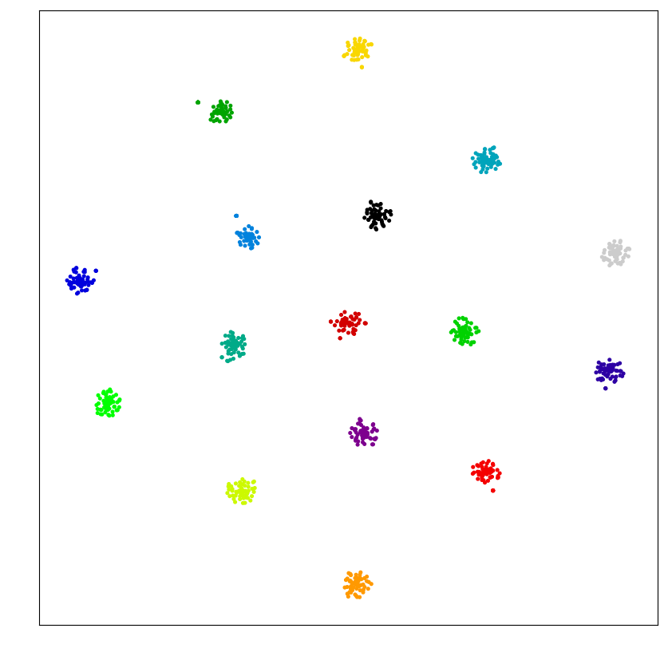
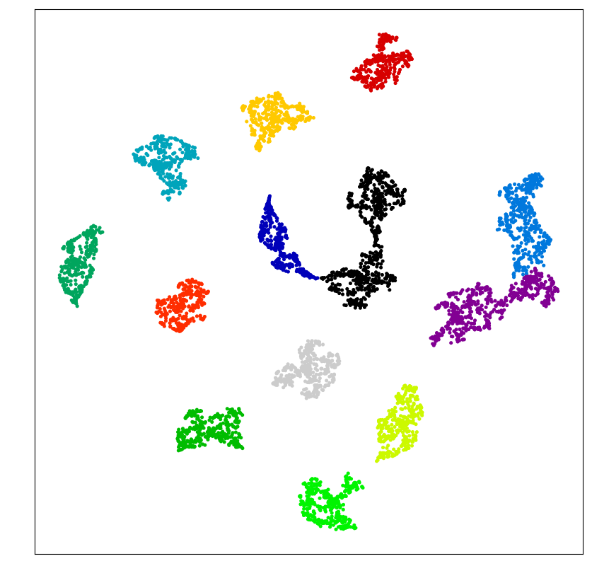

## autocluster
``autocluster`` is an automated machine learning toolkit for performing clustering tasks.   

## Prerequisites
- Python 3.5 or above
- Linux OS, or [Windows WSL](https://docs.microsoft.com/en-us/windows/wsl/about) is also possible

## How to get started?
1. First, install [SMAC](https://automl.github.io/SMAC3/stable/installation.html):
  - ``sudo apt-get install build-essential swig``
  - ``conda install gxx_linux-64 gcc_linux-64 swig``
  - ``pip install smac==0.8.0``
2. ``pip install autocluster``

## Examples
Examples are available in these [notebooks](/autocluster/examples/).

## Experimental results
{ width=70% }
- This dataset comprises of 16 Gaussian clusters in 128-dimensional space with ``N = 1024`` points. The optimal configuration obtained by ``autocluster `` (SMAC + Warmstarting) consists of a Truncated SVD dimension reduction model + Birch clustering model.

{ width=70% }
- This dataset comprises of 15 Gaussian clusters in 2-dimensional space with ``N = 5000 points``. The optimal configuration obtained by ``autocluster`` (SMAC + Warmstarting) consists of a TSNE dimension reduction model + Agglomerative clustering model.

## Links  
[Link](https://pypi.org/project/autocluster/) to pypi. 

## Disclaimer
The project is experimental and still under development.
